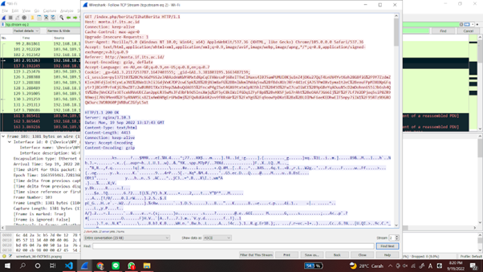
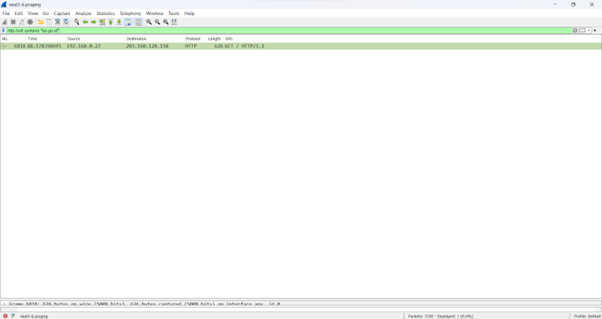

|     Nama    |     NRP    |
| :--------- |:--------    |
|Muhammad Amin | 5025201251 |
|Aiffah Kiysa Waafi | 5025201202 |
|Elthan Ramanda B | 5025201092 |

## 1.	Sebutkan web server yang digunakan pada "monta.if.its.ac.id"! 
### nginx/1.10.3
Proses :
1. Filter protocol http  karena monta protocolnya http

2. Klik kanan paket dari monta 

3. Server dapat dilihat yang berwarna biru baris ke-2

## 2.	Ishaq sedang bingung mencari topik ta untuk semester ini , lalu ia datang ke website monta dan menemukan detail topik pada website “monta.if.its.ac.id” , judul TA apa yang dibuka oleh ishaq ?
a. Ctrl + f : cari topik atau detailtopik

b. Setelah dapat packet klik link Full request URL nya

Evaluasi unjuk kerja User Space Filesystem (FUSE) oleh WAHYU SUADI

## 3.	Filter sehingga wireshark hanya menampilkan paket yang menuju port 80! 

## 4.	Filter sehingga wireshark hanya mengambil paket yang berasal dari port 21!

## 5.	Filter sehingga wireshark hanya mengambil paket yang berasal dari port 443!

## 6.	Filter sehingga wireshark hanya menampilkan paket yang menuju ke lipi.go.id !

## 7.	Filter sehingga wireshark hanya mengambil paket yang berasal dari ip kalian!

Di sebuah planet bernama Viltrumite, terdapat Kementerian Komunikasi dan Informatika yang baru saja menetapkan kebijakan baru. Dalam kebijakan baru tersebut, pemerintah dapat mengakses data pribadi masyarakat secara bebas jika memang dibutuhkan, baik dengan maupun tanpa persetujuan pihak yang bersangkutan. Sebagai mahasiswa yang sedang melaksanakan program magang di kementerian tersebut, kalian mendapat tugas berupa penyadapan percakapan mahasiswa yang diduga melakukan tindak kecurangan dalam kegiatan Praktikum Komunikasi Data dan Jaringan Komputer 2022. Selain itu, terdapat sebuah password rahasia (flag) yang diduga merupakan milik sebuah organisasi bawah tanah yang selama ini tidak sejalan dengan pemerintahan Planet Viltrumite. Tunggu apa lagi, segera kerjakan tugas magang tersebut agar kalian bisa mendapatkan pujian serta kenaikan jabatan di kementerian tersebut!

## 8.	Telusuri aliran paket dalam file .pcap yang diberikan, cari informasi berguna berupa percakapan antara dua mahasiswa terkait tindakan kecurangan pada kegiatan praktikum. Percakapan tersebut dilaporkan menggunakan protokol jaringan dengan tingkat keandalan yang tinggi dalam pertukaran datanya sehingga kalian perlu menerapkan filter dengan protokol yang tersebut.

## 9.	Terdapat laporan adanya pertukaran file yang dilakukan oleh kedua mahasiswa dalam percakapan yang diperoleh, carilah file yang dimaksud! Untuk memudahkan laporan kepada atasan, beri nama file yang ditemukan dengan format [nama_kelompok].des3 dan simpan output file dengan nama “flag.txt”.
a. Scroll setiap stream ketemu satu stream sus (stream 29)

b. Ubah format ke raw

c. Save as F05.des3

d. Pada linux jalankan command :
`openssl des3 -d -salt -in F05.des3 -out flag.txt`

## 10.	Temukan password rahasia (flag) dari organisasi bawah tanah yang disebutkan di atas!

Password : nakano
Flag.txt : JaRkOm2022{8uK4N_CtF_k0k_h3h3h3}
